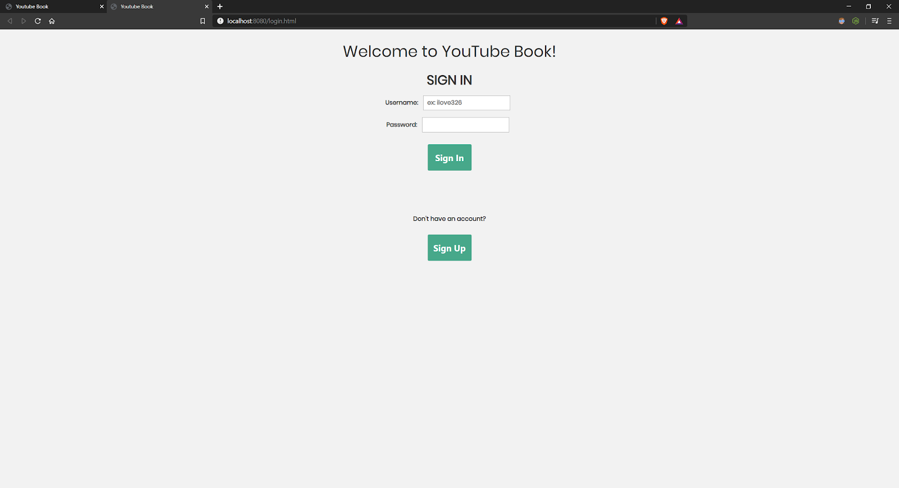
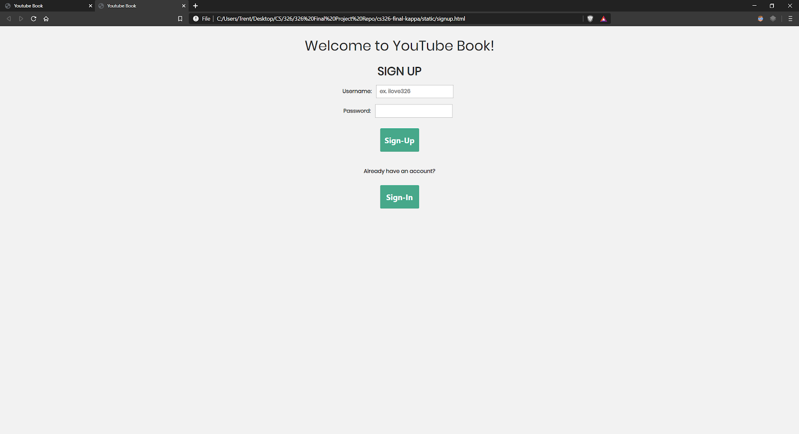
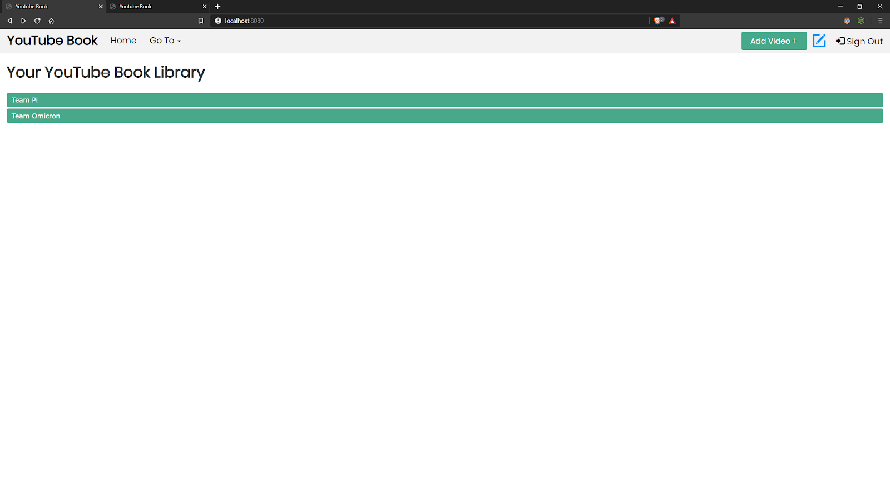
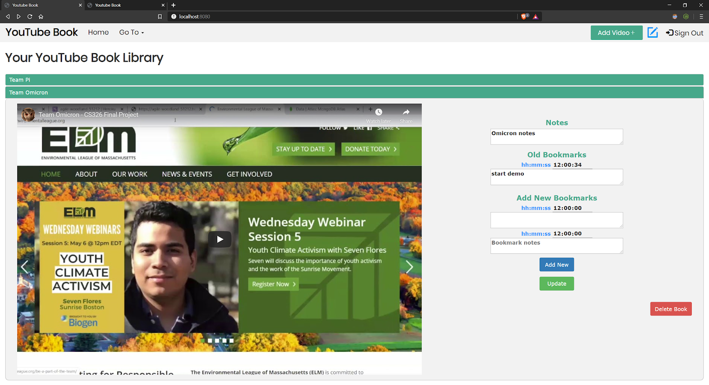
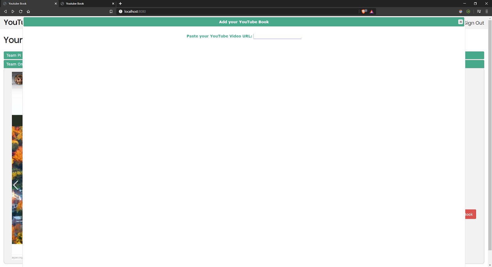
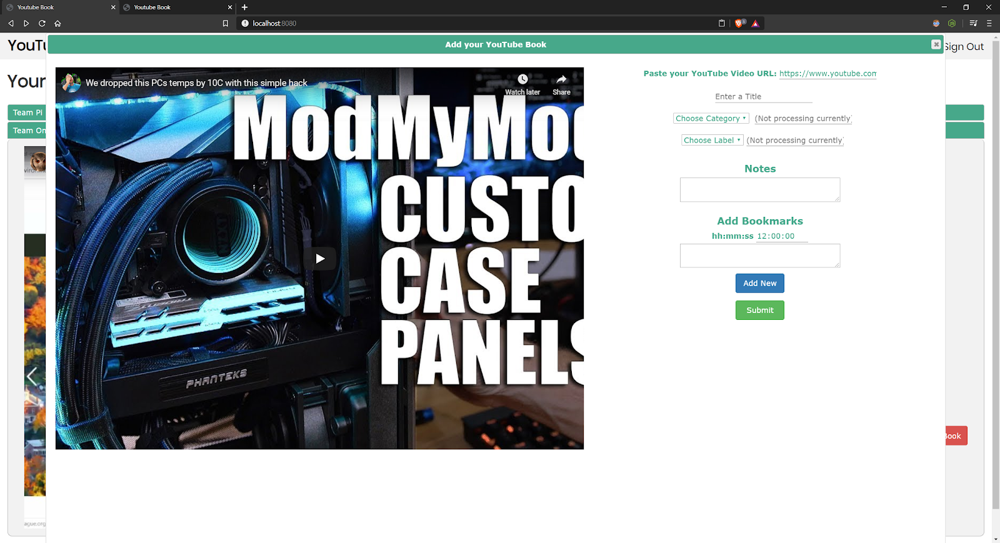
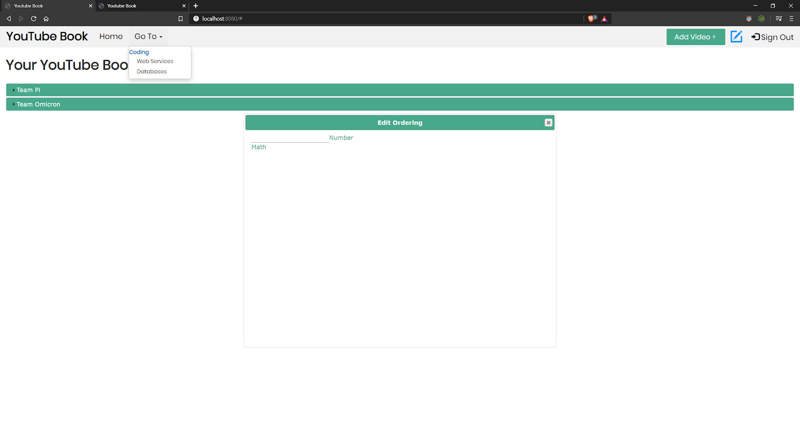

# 1) Team Kappa
## 2) YouTube Book
### 3) Spring 2020

### 4) Overview
YouTube Book is a website where users can create YouTube Books with notes and “bookmarks” or timestamps of their video that they can take notes on and jump to. This is innovative because it can help people break down their favorite videos either fun or educational for future use, just like a book that they can flip to their favorite bookmarked pages. Users can create, read, update, and delete their books.

### 5) Team Members
Eric Shi: eric60
John: johnathancampana
Trent: tbourgoin1

### 6) User Interface
**Login and Signup Screen -** For starters, we have a user login screen. Although we have implemented this, it does not function currently as we have no authentication system working. Theoretically, a user would enter their information and “Sign In” to access their YouTube Book. If they did not have an account, they could select “Sign Up” and be brought to the second screenshot below to sign up.

**Main Page View -** Once a user is logged in, they will be greeted with something like the screenshot below. This lists a user’s videos. There are two for this mock user, all in the “Coding” category and with the “Web Services” label. The category/label information is not visible in the current version of our application, since we were not able to implement these things in time for the class ending. For now, we just have a general list of videos under one category and label as mentioned.

**Accordion Video View -** Clicking one of the green bars spanning across the screen will expand the video with a jQuery accordion, and show all data the user has input for that video. Here, the user has one bookmark at timestamp 0:34, along with some video notes and bookmark notes. Pressing the “Update” button is for updating the current video (after you input some new notes and/or bookmarks in the text areas), and is where our update function is called. The red delete button is used to delete the selected book. The “Add New” button will insert a new area to input bookmarks, which will be inserted upon pressing ”Update” (as long as they aren’t empty). The second screenshot below shows what the UI looks like after pressing “Add New”.

**Add Video Modal -** Selecting “Add Video+” (top right of above screenshot) will bring up a modal like the one below, where you can input a YouTube URL and add some details in about the video you’re adding to your YouTube Book. The full modal will not appear until a valid YouTube link is pasted into the field in the first screenshot.

**Main Page Accessories -** Finally, selecting “Go To” brings up a list of categories and labels that you can quickly click to jump to (although this does not currently function since categories and labels are not implemented currently). The pencil icon next to “Add Video+” in the top right is for editing the ordering of videos, and will bring up a modal shown in the center of the screen below. But, functionality for this is not implemented yet either. “Sign Out” will currently redirect you to the login screen, although there is no backend code involved with this because of the lack of authentication.

### 7) APIs
* video/create
* video/readAll
* video/update
* video/delete

### 8) Database
**The following is our database structure:**

User document {  
{  
    "_id": <Objectid1>,  
    "username":  String,                         	// username of user on login  
    "password": String,                     	// md5 hash of the user’s password
    "email": String,                            			// email of user  
    "categories": [{    : Array<Objects>        	// Array of Category  objects  
        "categoryName": String,               // Name of the category e.g. Coding   
        "categoryOrder": Number   		//Order of the category among other categ.  
        "labels": [{       : Array<Objects>     		// Array of Label objects  
            "labelName": String                         // Name of the label  
            "labelOrder": Number       	// Order of the label within the category  
            "videos": [{   : Array<Objects>   // Array of video objects under the   label  
                "videoUrl": String,                 // Url of the Youtube video  
                "videoTitle": String,             	// title of the Youtube book  
                "videoOrder": Number         // order of the video within label  
                "notes": String,                  // General notes for the video  
                "bookmarks": [{                 // Array of bookmark objects  
                    "timestamp": String,   // timestamp of bookmark e.g. 00:01:01   in hh:mm:ss	  
                    "timestampNotes": String  		// notes for the bookmark   timestamp  
                }]  
            }  
         }]  
}  

### 9) URL Routes
**/video/:username/create**
Maps to createVideo function that creates a new video for the specified user

**/video/:username/readAll**
Maps to readAll function that reads all the videos saved to the user’s profile

**/video/:username/update**
Maps to updateVideo function that updates changes that the user makes (in title, notes, or bookmarks) 

**/video/:username/delete**
Maps to deleteVideo function that deletes the specified video for the current user

### 10) Authentication
Authentication was not implemented and the data is centered around one user document in mongoDB. You can currently change users in client.ts/js by modifying the “username” field at the top of the file, which will display different videos for different users. However, there is no actual implementation in the app to switch/authenticate users.

### 11) Division of Labor
* **Eric** worked on the YouTube video loader and bookmark timestamps, video readAll and video create APIs. 
    * There is a mismatch in github for the client file because the YouTube loader took more code than expected, initially expecting 100 lines with iframe tags and simple js functions but ended up being longer ~500 lines due to having to load it synchronously. 
    * Bookmarks were also closely tied to the players and there was not enough time to transfer knowledge and pivot roles to finish for milestone 2 which was having all the client side code finished.
    * We also planned to have me work on YT loading and bookmarks, Trent on categories, and John on labels for CRUD, but it became very confusing by doing a top down approach instead of a bottom up approach where we would finish the video CRUD first and build on top of them instead of trying to bring them all together at the same time. Doing it at the same time resulted in us pivoting to remove categories and labels and focus on video CRUD. 

* **Trent** worked on a majority of the CSS involved with the project, along with the backend and some front end implementation of update() and delete() for our CRUD functions. During milestone two, also created read(), but when we discovered read was not to be implemented in favor of readAll(), it was deprecated and left in a hardcoded state. Finally, assisted with various database and videoInserter tweaks, as well as implementing a way to update bookmarks on videos.

* **John** worked on delete function for removing books and videoInserter function for populating the page. Prevented duplicate insertions by adding isFound checking to create function. Worked on styling in various areas like video notes/bookmarks, add video modal and buttons. Wrote html for login and sign up pages that we didn’t end up using.

### 12) Conclusion
* We have learned principles of clean code, working with jQuery, TypeScript, and asynchronous processing in this project. Clean code is essential in maintaining and adding to existing code, therefore it’s best to refactor early and often such as modularizing code. Refactoring too late can cause a maintenance nightmare and untenable code for people reading it. Clean code does one thing well and is focused, which can be expressed through classes, short methods of 5-8 lines, and little to none global variables. Our implementation did not follow these guidelines closely, and it resulted in some issues of finding/organizing code in client.ts. If we were to start again, a number one priority would be to modularize our backend code as we went.
* One technical challenge was creating the sequence of events between the YT players and the other components. The order ended up being getting all the data, inserting the appropriate html, loading the YT Players into the html, and finally initializing the accordion which requires data to be already in the html before properly showing.
* We would have liked to learn the module client lesson earlier on and to think of grouping code into classes. 