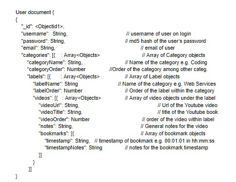

# Milestone 3 md

## Notes: 
* To limit our scope in this project to meet the timelines we didn’t do CRUD on category or labels, and did not consider the orders on categories, labels, or videos. We instead just list out all the videos of the user without categories or labels.
We were unable to make 00 in hours so it is 12 in the UI for bookmark timestamps

* Due to major issues with nested Mongo objects, we were unable to implement delete() and update() for all **but the first video**. Whichever video appears at the top of the list can be updated and deleted (so, you may delete several videos this way). 
These functions do function the way we want them on the first video in the list to show proof of concept, but not any others.
Note that read() has no place in our project. readAll() is what we used as a replacement for that, and it is what initially loads all videos in the list automatically.

## CRUD Testing
* Create: Go to Add Video button in top right
* Read: On page load it readsAll and pulls down all videos
* Update: Update the 1st video’s notes and press submit in the tab. We are only able to update the 1st video notes for now.
* Delete: Press delete on the 1st video. We are only able to delete the 1st video for now.

## Database Docs
  
User document {  
{  
    "_id": <Objectid1>,  
    "username":  String,                         	// username of user on login  
    "password": String,                     	// md5 hash of the user’s password
    "email": String,                            			// email of user  
    "categories": [{    : Array<Objects>        	// Array of Category  objects  
        "categoryName": String,               // Name of the category e.g. Coding   
        "categoryOrder": Number   		//Order of the category among other categ.  
        "labels": [{       : Array<Objects>     		// Array of Label objects  
            "labelName": String                         // Name of the label  
            "labelOrder": Number       	// Order of the label within the category  
            "videos": [{   : Array<Objects>   // Array of video objects under the   label  
                "videoUrl": String,                 // Url of the Youtube video  
                "videoTitle": String,             	// title of the Youtube book  
                "videoOrder": Number         // order of the video within label  
                "notes": String,                  // General notes for the video  
                "bookmarks": [{                 // Array of bookmark objects  
                    "timestamp": String,   // timestamp of bookmark e.g. 00:01:01   in hh:mm:ss	  
                    "timestampNotes": String  		// notes for the bookmark   timestamp  
                }]  
            }  
         }]  
}  

## Breakdown of Work
* Eric worked on the readAll (pulling down all video data from each label) on page load and create (creating a YouTubeBook). 

There is a mismatch in git lines because of accidentally committing node modules before doing gitignore on them earlier. 

There is a mismatch in git commits due to a habit of committing smaller changes while others only committed for larger changes. I believe my total lines of code changed is about the same as others at around 1200 lines since the client is only 500 lines.

 I also copied and pasted the server side code from the in class examples which inflated my line numbers. I also refactored and wrote over initial code from my teammates which inflated my line numbers.

I explained in a private piazza post that the bookmarks and YouTube videos loading on screen were tied together and took longer than expected. We expected just an iframe html tag but we actually needed to load JS from the YouTube API and working with it took more lines of code than expected but overall was inflated due to moving code around to be more readable, as this refactor was before the client module lesson. 

Unfortunately the knowledge base of the client code snowballed and it was not possible for my team to understand it in time for the 2nd milestone, and this was my fault for not modularizing the code. It was untenable for someone reading it and I hope there is leniency in this case as I did not intend to take it over but had to in order to finish it out for the milestones, thus snowballing even more until this milestone 3. The client code became over 700 lines long and is not easy to read or understand. The trigger points are all at the top but there are many helper functions such as the YouTubeLoader which should’ve been in another class.

However doing this taught me a lot about the importance of modularizing code and making code readable for others. I will in the future refactor and modularize early rather than waiting until it is too costly and timely to refactor. I will also read Clean Code by Robert Martin this month to avoid writing unreadable code in the future.

Overall, my commits and line changes are only higher due to the dependencies of the frontend and was not intentional or planned. I also refactored many lines which might have overwrote their lines in git blame. Hopefully this explains any mismatch concerns! Thank you.

* John worked on implementing delete functionality with the mongodb and formatting the JSON. Also helped with creating the videoInserter that inserts the videos on the page. Encountered difficulties with webpack that could not be resolved ‘command webpack not found’ when trying to run it individually but running npm run build showed that webpack was installed and encountering others errors. This prohibited me from testing some client code, namely ensuring the delete button on the UI actually worked, but Trent and Eric helped out a lot.

* Trent worked on update, delete, and videoInserter. Implemented all code for update, co-authored delete, and assisted with several videoInserter bugs and database modifications. Unfortunately could not implement update or delete on most videos, just the first one on the list. Nested MongoDB queries proved to be a tough challenge in this milestone. 
