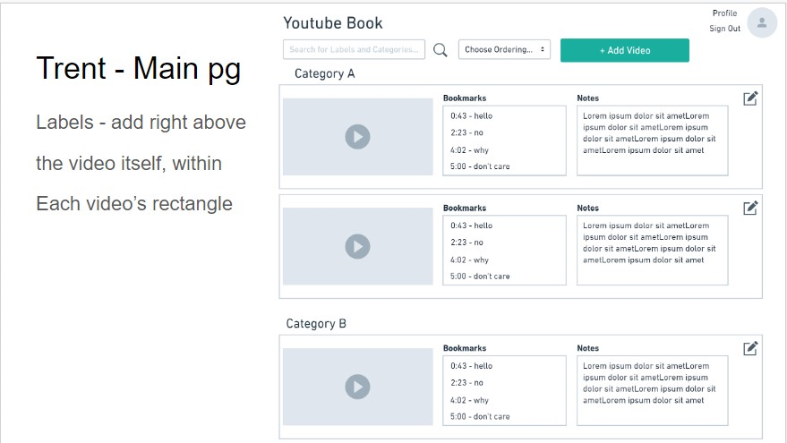
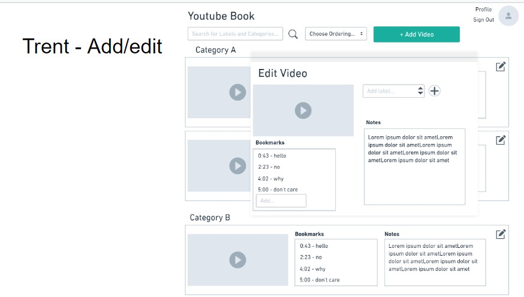
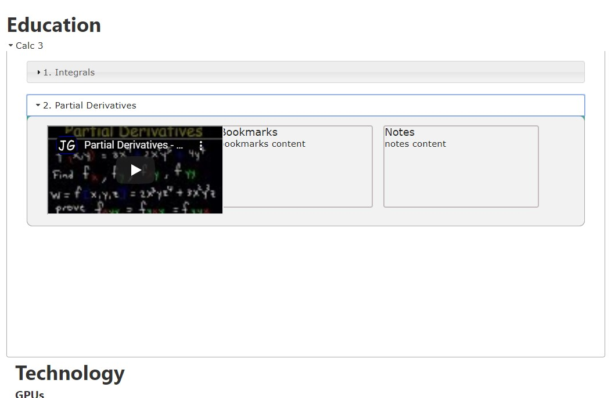
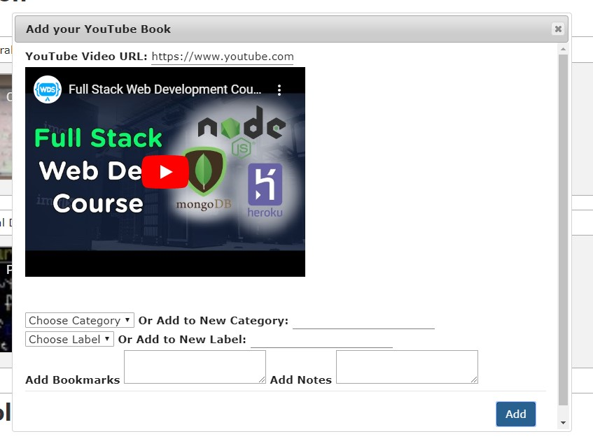
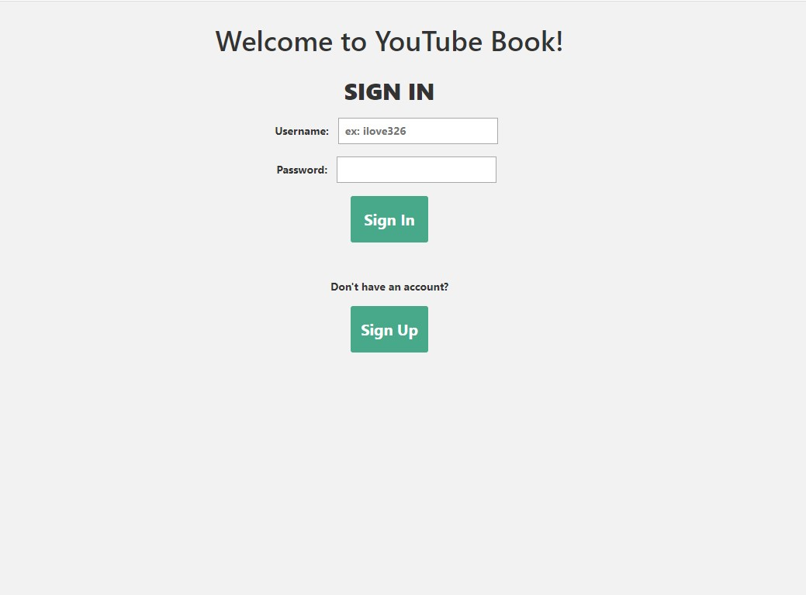

## Team Name: Kappa

## Part 0: Data Interactions

* **Login page:** The first page the user encounters is the log in page. This has fields for username and password as well as a link to the sign up page. After entering a valid username/password combination, the user will press the “Sign In” button and move to the main page.

* **Sign up page:** First time users will arrive at this page after clicking “Sign Up” on the Sign in page. This page has the same fields, but will create an account with the username and password provided. They can return to the sign in page by clicking the “Sign In” button. If they enter a valid username and password and press “Sign Up” they will be brought to the main page. 

* **Main page:** The user lands here after logging in. This page is a scrollable view of the videos in their “book”. The videos are sorted by category (Entertainment, Education, etc.). The main page will also show a thumbnail of each video and a preview of the notes and bookmarks the user has made. From here, the user may select a video which opens the pop up modal. In the top right corner will be a button for the user to sign out, which will log them out and redirect to the log in page.

* **Add/edit video modal:** If the user presses the “Add video” button at the top of the page or the pencil and paper button on an existing video, a modal will pop up. From here they will see a preview of the video as well as the existing label, bookmarks, and notes. They can simply type in the appropriate box to add a bookmark or note and can select/change the label from a list of values. If the user arrives here from the “Add video” button, the fields will be blank, whereas if they are editting an existing video, the fields will be populated with the existing data. 

## Part 1: Wireframes
1. 
2. 

## Part 2: HTML and CSS
1. 
2. 
3. 
4.  

## Work Breakdown
* Eric: Worked on the main page setting up div structures and worked on modal for adding videos.
* Trent: Made wireframes, worked on most of the CSS for the site and adjusted HTML layout where needed
* John: Worked on login and signup HTML, added some CSS, JS accordions, write ups for wire-frames
